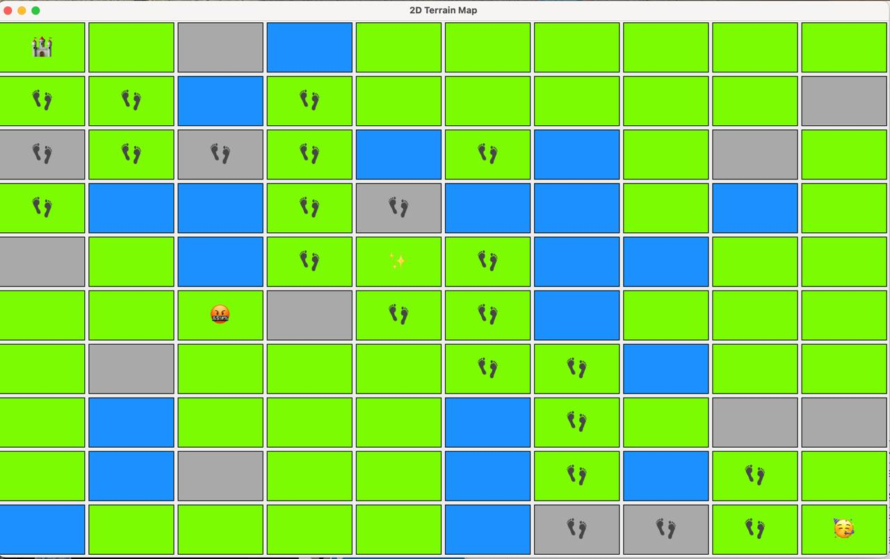

# 🏰 Treasure Hunt AI Game

## 📖 Overview
This project is a **Java client application** built as part of a university software engineering assignment. It simulates two AI players competing to explore a procedurally generated map, collect their hidden treasure, and conquer the opponent’s castle. The clients are coordinated by a central server using a REST API.

The goal was to create a production-ready application following software engineering best practices, including clean architecture, unit testing, logging, and advanced algorithms.

---

## 🎮 Game Concept
Two autonomous clients (AIs) compete on a shared map:
- Each AI generates half of the game map and exchanges it with the server.
- Both AIs explore the map to find their own treasure (hidden on their starting half).
- Once a treasure is collected, they must locate and capture the opponent’s castle.
- The first AI to succeed wins the game.

The map consists of fields of different terrain types:
- 🌊 Water – impassable.
- 🌿 Meadow – normal movement.
- ⛰️ Mountain – requires multiple actions to cross and provides a visibility boost.

The server enforces rules, coordinates turns, and validates actions. The game is turn-based, with a maximum of 320 actions and 5 seconds per AI turn.

---

## 📦 Features Implemented
- **Client-Server Communication**
  - REST API integration using Spring’s `WebClient`.
  - Dynamically handles server URLs and game IDs via start parameters.
- **Procedural Map Generation**
  - Randomized map half generation adhering to terrain and placement rules.
  - Flood-fill validation to ensure field connectivity.
  - Open-Closed Principle (OCP) applied for maintainability.
- **AI Pathfinding**
  - Implemented **Dijkstra’s algorithm** for shortest path calculation.
  - AI intelligently explores unknown areas and prioritizes objectives.
- **CLI User Interface**
  - Text-based visualization using UTF-8 emoticons for terrains, players, treasure, and castles.
  - Displays game progress and final outcome (win/loss).
- **Error Handling**
  - Custom checked and unchecked exceptions for critical logic.
  - Validates game state and network responses.
- **Logging**
  - Integrated SLF4J with Logback for structured, multi-level logging.
  - Logs key events (game start, turn actions, errors).
- **Unit Testing & TDD**
  - Used JUnit 5 and Mockito for mocking server interactions.
  - Developed key features using Test-Driven Development (TDD).
- **Refactored Architecture**
  - Model-View-Controller (MVC) pattern.
  - Observer pattern for UI updates.
  - Dependency Injection for loose coupling.

---

## 🛠️ Technologies Used
- Java 17
- Spring WebClient (REST API)
- SLF4J & Logback (logging)
- JUnit 5 & Mockito (testing)
- Maven (build tool)
- UTF-8 CLI Visualization

---

## 🚀 How to Run
Build and run the client with:

```bash
java -jar <ClientFileName>.jar <Mode> <BaseServerUrl>:<Port> <GameID>
```

- `<Mode>`: Run mode -`TR` for evaluation mode, `GUI` for playing mode.
- `<BaseServerUrl>:<Port>`: Server address and port.
- `<GameID>`: Unique game ID assigned by the server.

*(Server details are internal to the university and are not publicly shared)*

---

## 📸 User Interface Preview



---

## 💡 What I Learned
- Implementing REST API clients in Java.
- Using Spring WebClient for network operations.
- Procedural content generation with validation.
- Applying Dijkstra’s algorithm for pathfinding.
- Clean code practices: MVC, Observer, OCP.
- Writing robust unit tests with mocks and TDD.
- Effective error handling and structured logging.

---

## 📖 Assignment Context
This project was developed as part of a software engineering course at the **University of Vienna**. It demonstrates the ability to plan, build, and refine a Java application to meet complex requirements, simulating real-world software development workflows.

---
